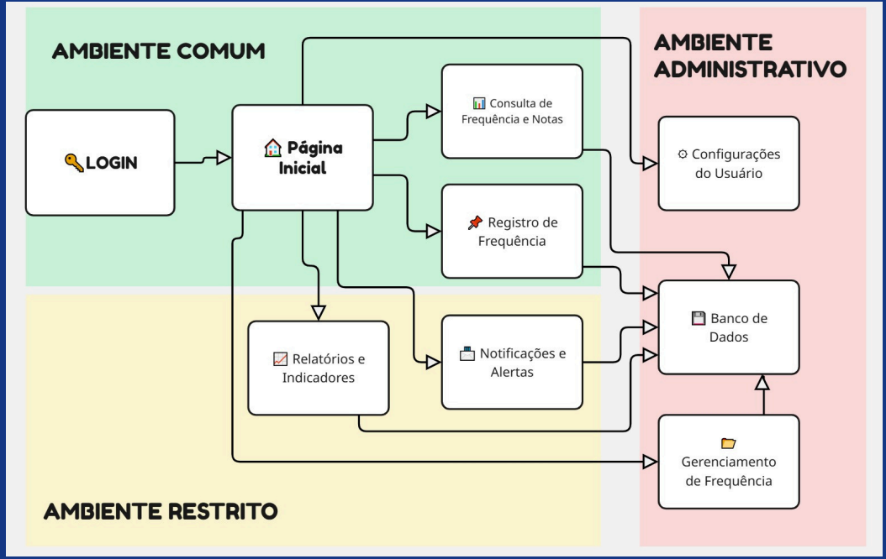
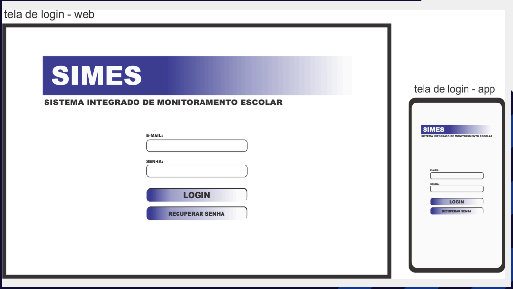
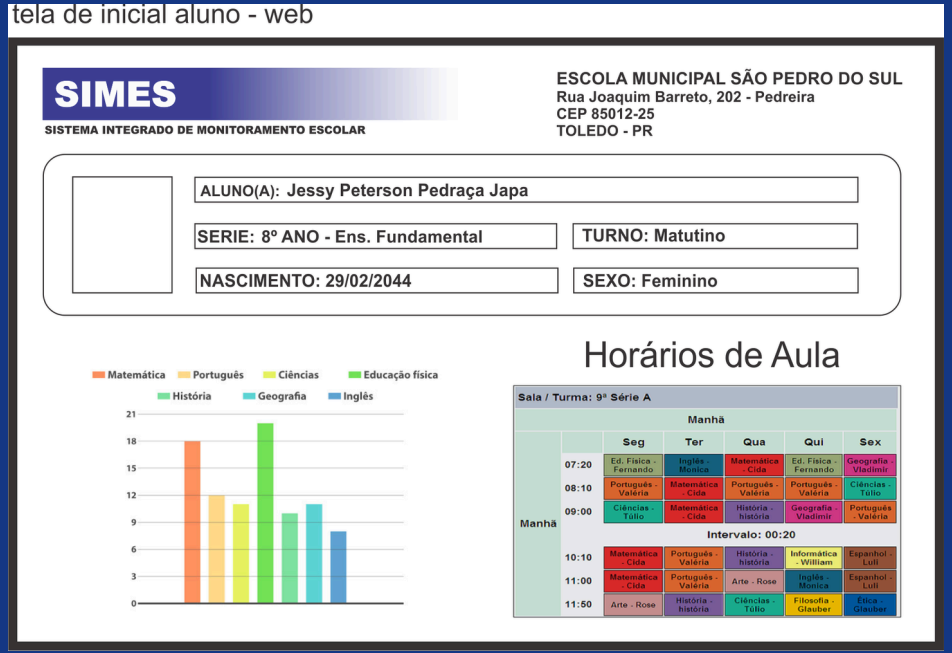
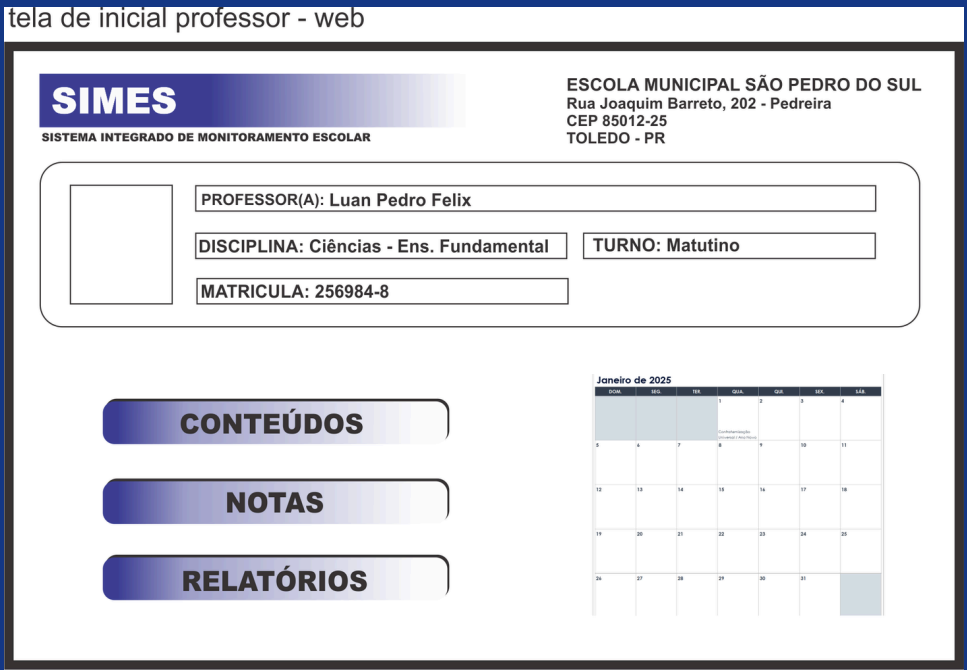

# Documentação de Projeto de Software
## SIMES - Sistema Integrado de Monitoramento Escolar

---

**Uninorte**

**Análise e Desenvolvimento de Sistemas**

---

**Título do Projeto:** SIMES - Sistema Integrado de Monitoramento Escolar

**Autores:**
* Davi Peterson
* Jéssica Batista
* Gabriel Vasconcelos
* Frank Junior
* Antonio Carlos
* Gabriely Queiroz
* Marli

**Orientador(a):** Euler Azevedo

**Data: 20/11/2026** 

---

### Sumário
1.  Introdução
2.  Especificação de Requisitos

    2.1. Requisitos Funcionais

    2.2. Requisitos Não Funcionais
3.  Modelagem do Sistema

    3.1. Atores Principais

    3.2. Fluxo de Funcionamento
4.  Arquitetura do Software

    4.1. Visão Geral da Arquitetura

    4.2. Tecnologias Utilizadas
5.  Design da Interface (UI/UX)

    5.1. Protótipos de Baixa Fidelidade
6.  Plano de Testes

    6.1. Estratégia de Testes

    6.2. Critérios de Aceitação
7.  Cronograma e Recursos

    7.1. Fases do Projeto

    7.2. Alocação de Recursos
8.  Considerações Finais

    8.1. Riscos e Mitigações

    8.2. Conclusão
9.  Referências

---

### 1. Introdução

#### 1.1. Contextualização do Projeto
A frequência escolar é um dos indicadores mais críticos para o sucesso educacional. A ausência recorrente de alunos é, muitas vezes, o primeiro sinal de um processo que pode culminar no abandono escolar. Atualmente, as instituições enfrentam desafios como o controle manual de frequência, a comunicação fragmentada entre escola e família e a sobrecarga da equipe pedagógica, resultando em baixos rendimentos e altos índices de evasão.

#### 1.2. Objetivo Geral
Desenvolver e implementar um Sistema Integrado de Monitoramento Escolar (SIMES) que automatize o controle de frequência, facilite a comunicação entre a comunidade escolar e proporcione uma gestão eficiente de dados educacionais.

#### 1.3. Objetivos Específicos
* Automatizar o controle de frequência dos alunos através de biometria.
* Integrar alunos, pais, professores e gestores em uma única plataforma.
* Oferecer acesso via portal web e aplicativo móvel.
* Gerar relatórios e análises para decisões estratégicas.
* Reduzir a evasão escolar e melhorar o desempenho acadêmico.

#### 1.4. Justificativa
O SIMES surge como uma solução inovadora para otimizar a gestão da frequência escolar, promovendo maior integração e permitindo intervenções pedagógicas rápidas, fortalecendo a comunidade e melhorando os resultados acadêmicos.

---

### 2. Especificação de Requisitos

#### 2.1. Requisitos Funcionais

| Código | Requisito | Descrição | Prioridade |
| :--- | :--- | :--- | :--- |
| RF001 | Autenticação de Usuário | Permitir que usuários (aluno, professor, responsável, gestor, admin) acessem o sistema com login e senha seguros. | Alta |
| RF002 | Registro Automatizado de Frequência | Registrar a presença dos alunos de forma automatizada via biometria ("Finger Print"). | Alta |
| RF003 | Consulta de Frequência e Notas | Permitir que alunos e responsáveis consultem o histórico de frequência e notas pelo portal ou aplicativo. | Alta |
| RF004 | Envio de Notificações | Enviar notificações em tempo real aos responsáveis em caso de ausência do aluno. | Alta |
| RF005 | Painel de Controle Escolar | Fornecer a gestores e pedagogos um painel com dados consolidados, relatórios e indicadores. | Alta |
| RF006 | Lançamento de Conteúdos e Notas | Permitir que professores lancem conteúdos e notas através da plataforma. | Média |
| RF007 | Gestão de Usuários | Permitir que o administrador cadastre, edite, remova e defina permissões de usuários. | Média |
| RF008 | Geração de Relatórios | Permitir a geração de relatórios de frequência, evasão e desempenho por turma, disciplina ou período. | Alta |

#### 2.2. Requisitos Não Funcionais

* **Desempenho:** O sistema será projetado para uma arquitetura multi-tenant, capaz de atender múltiplas instituições de ensino de forma isolada e segura. A infraestrutura deve ser escalável para suportar o crescimento do número de usuários e escolas sem degradação da performance.

* **Segurança:** A segurança é um pilar não negociável. Biometrias e senhas serão armazenadas utilizando algoritmos de criptografia robustos. O sistema seguirá estritamente as diretrizes da Lei Geral de Proteção de Dados (LGPD), garantindo a privacidade e a integridade das informações e prevenindo qualquer tipo de vazamento de dados.

* **Disponibilidade:** O sistema operará em regime 24/7. O processo de desenvolvimento seguirá uma estratégia de Git Flow com branches separadas para produção (`main`) e manutenção/desenvolvimento (`develop`), garantindo que atualizações e manutenções ocorram sem impactar a estabilidade do sistema em uso.

* **Usabilidade:** As interfaces do aplicativo e do painel administrativo serão projetadas para serem intuitivas, claras e de fácil utilização, minimizando a curva de aprendizado para todos os perfis de usuário.

---

### 3. Modelagem do Sistema

#### 3.1. Atores Principais
* **Aluno:** Consulta suas informações acadêmicas.
* **Professor:** Gerencia suas turmas, lançando notas e conteúdos.
* **Responsável (Pais):** Acompanha a vida escolar do aluno em tempo real.
* **Gestor Escolar / Pedagogo:** Acessa dados consolidados para gestão estratégica.
* **Administrador:** Gerencia as configurações e usuários do sistema.

#### 3.2. Fluxo de Funcionamento
O fluxo abaixo ilustra a navegação e as interações entre os diferentes ambientes do sistema.

---

### 4. Arquitetura do Software

#### 4.1. Visão Geral da Arquitetura
A arquitetura do SIMES será segmentada em dois componentes principais, visando desacoplamento e especialização:
1.  **Aplicativo Móvel:** Voltado para os usuários finais (alunos, professores e pais), oferecendo uma experiência otimizada para interação diária.
2.  **Painel Administrativo Web:** Uma aplicação web robusta para os gestores escolares e desenvolvedores, focada em gerenciamento, visualização de dados e configuração do sistema.

Essa abordagem permite que cada "ponta" do sistema evolua de forma independente, utilizando as tecnologias mais adequadas para cada finalidade. A comunicação entre o app/painel e o servidor será feita através de uma API RESTful bem definida.

#### 4.2. Tecnologias Utilizadas
* **Front-end (Painel Administrativo):** Next.js
* **Mobile (App):** React Native (com build para iOS e Android)
* **Back-end:** Java
* **Banco de Dados:** MySQL
* **Controle de Versão:** Git

---

### 5. Design da Interface (UI/UX)

#### 5.1. Protótipos de Baixa Fidelidade
Os protótipos validam o fluxo de navegação e a disposição dos elementos nas telas.

**Tela de Login (Web e App):**

**Página Inicial - Aluno:**

**Página Inicial - Professor:**

---

### 6. Plano de Testes

#### 6.1. Estratégia de Testes
A abordagem de qualidade combinará testes automatizados para garantir a estabilidade das regras de negócio e da API, com testes manuais exploratórios (testes de clique) focados na usabilidade e na experiência do usuário final nas interfaces do aplicativo e do painel.

#### 6.2. Critérios de Aceitação
Para a primeira versão (MVP) ser considerada um sucesso e pronta para simulação/implantação, as seguintes funcionalidades críticas devem estar 100% operacionais:
1.  O ciclo completo de gerenciamento de usuários (cadastro, login, edição, definição de perfis).
2.  O fluxo de informações para pais e responsáveis, incluindo a consulta de dados e o recebimento de notificações de ausência.

---

### 7. Cronograma e Recursos

#### 7.1. Fases do Projeto
Por se tratar de um projeto de simulação sem um prazo final definido, o cronograma será flexível e organizado em fases, permitindo um desenvolvimento iterativo e incremental.

#### 7.2. Alocação de Recursos
A equipe dividirá as tarefas de acordo com as especialidades de cada membro, promovendo um ambiente colaborativo e de aprendizado contínuo entre as áreas de front-end, back-end, mobile e testes.

---

### 8. Considerações Finais

#### 8.1. Riscos e Mitigações
A análise de riscos é um processo contínuo. Abaixo estão alguns riscos iniciais potenciais e suas respectivas estratégias de mitigação (a serem validadas pela equipe):

| Risco Potencial | Nível | Estratégia de Mitigação |
| :--- | :--- | :--- |
| Falha ou imprecisão no hardware de biometria. | Médio | Prever um método de registro alternativo (ex: código QR, digitação de matrícula) como contingência. |
| Baixa adesão de pais e alunos ao aplicativo. | Alto | Realizar campanhas de comunicação na escola, garantir que o app seja extremamente fácil de usar e oferecer benefícios claros. |
| Complexidade na integração do back-end Java com o React Native. | Médio | Definir um contrato de API claro e estável desde o início; realizar provas de conceito para validar a comunicação. |

#### 8.2. Conclusão
O SIMES é uma solução inovadora para transformar a gestão escolar, garantindo mais eficiência, transparência e melhoria na aprendizagem. Com a automatização da frequência e a comunicação eficaz, a escola se torna um ambiente mais organizado e preparado para os desafios educacionais, impactando positivamente toda a comunidade.
